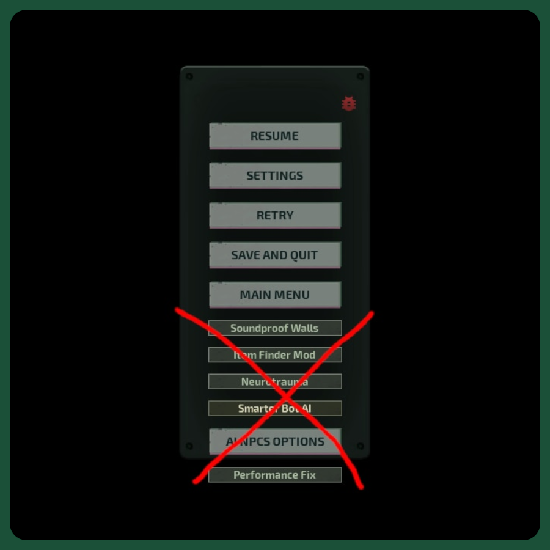

# Mod Buttons Remover

The mod removes the ugly buttons of other mods from the pause menu, transfers them to a neat menu and leads to a uniform style.

Source: [github.com/ThaEin/barotrauma-mod-buttons-remover](https://github.com/ThaEin/barotrauma-mod-buttons-remover)
